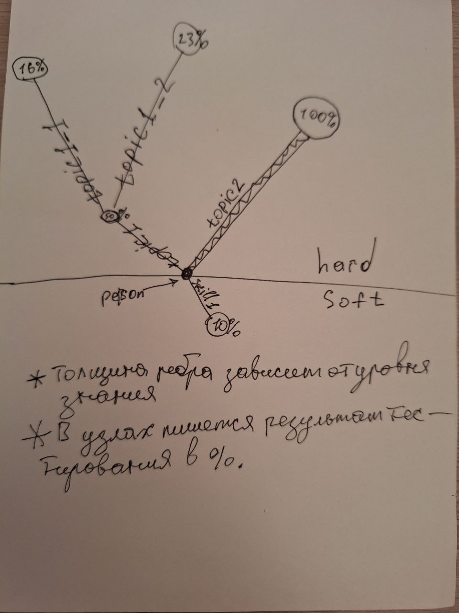

#LANG/RU #STRUCT/SYSTEM 
# Термины:
1. **Граф компетенций** (**ГК**)- структура содержащая узлы с различными [[Описание хештегов#Структурные роли|структурными ролям]];
2. **Матрица компетенций** (**МК**) в **широком** смысле это - это HR-инструмент, который помогает оценить ключевые способности сотрудника для конкретной должности или области (**[Иточник](https://b2b.productstar.ru/blog/obuchenie_pod_matrizu)**). Чаще всего представляется в виде таблицы, но не ограничивается ею;
3. **Матрица компетенций** (**МК**) в **узком** смысле это - структура генерируемая на основе **графа компетенций** для конкретной роли в конкретной команде;
4. [[Описание хештегов#Структурные роли узлов#Список|Системный, информационный, тематический узел]];
# Цели графа компетенций:
1. Автоматизировать и унифицировать оценку знаний программистов;
	- Структура матрицы компетенции генерируется автоматически, исходя из наполнения [уровеней компетенций](Описание%20хештегов#Уровень%20компетенций), выбранных [[Описание хештегов#Структурные роли узлов#Список|тематических узлов]] и их пороговых значений.
1. Масштабировать и адаптировать оценку под цели команд;
	- Каждая команда будет иметь возможность генерировать структуру матрицы компетенций и на её основе автоматизировано тестировать нужные им компетенции у кандидата.   
2. Создать открытое, саморазвивающееся сообщество систематизирующее знания и их оценку.
	- Предоставить возможность каждому желающему поучаствовать в создании базы знаний и оценок;
	- Валидировать структуру новвоведений через прогон тестов в CI;
	- Валидировать смысловую составляющую через менторов и владельцев графа.
	
# Быстрый старт для команды
Всё начинается с того, что в команду понадобился новый сотрудник и команде следует оценить его знания. Для автоматизации проверки этих знаний следует использовать задание сгенерируемое по матрице компетенции из графа компетенций.
Чтобы получить матрицу компетенций, следует сгенерировать её по инструкции ниже или взять готовый шаблон из корня проекта с именем "Competence matrix template.md" #TODO заменить на ссылку
и перейти к пункту 3 из инструкции ниже.
Шаги для генерации тестов:
 1. Открыть проект MatrixGenerator и следовать по инструкции #TODO добавить ссылку на инструкцию;
 2. На выходе получим файл "Competence matrix template.md";
 3. Открываем его и изменяем дефолтные значения под свои нужды;
 4. Открыть проект TestGenerator и следовать по инструкции #TODO добавить ссылку на инструкцию;
 5. На выходе мы получаем некий файл с тестовыми заданиями (скорее всего это будет MD файл);
 6. Вместе с тестируемым заполняем его;
 7. Открываем EstimationGenerator и следуем его инструкции #TODO добавить ссылку на инструкцию
 8. На выходе получаем некоторую статистику по прохождению (если будем хранить другие прохождения, то сравнительную статистику).
#TODO
# Быстрый старт тестируюмого
#TODO Если документ с заданиями будет заполняться командой, то этого пункта не будет.

# Быстрый старт для контрибьюторов
#TODO
Один PullRequset должен состоять из двух коммитов:
1. Содержит тематические узлы и информационные узлы;
2. Содержит оценивающие узлы.
Это позволит использовать chery pick для переноса коммита из пункта 1 в ветку, которая содержит только теорию и топики.

# Дорожная карта развития
#TODO описать перечень недостающих тем или наличие оценивающих узлов (голосование оформить через Polly)
Перечень не решённых проблем:
 1. Что-то; 
Идеи для реализации:
	1. Предлагаю сделать визуализацию результатов тестирования графа компетенций, как на рисунке ниже.
	

# Вдохновлено:
1. Шаблон 1 матрицы - Таранов Роман; 
2. Шаблон 2 матрицы - Родин Денис;
3. Курс Java Middle Developer - Ленок Антон;
4. Курс Java Beginner - Кудряшёв Сергей;
5. "Куда  расти?" с Андреем Смирновым;

# ЧАВО (Частые вопросы)
- Как работать с Mark Down разметкой?
	- [[Шпаргалка по синтаксису разметки Markdown|Что такое Mark Down]];
	- Инструкция для Obsidian - [почитать](https://publish.obsidian.md/help-ru/Начните+здесь);
	- Инструкция для Obsidian - [посмотреть](https://rutube.ru/video/bec4ef4f5aea83cc161ad98569e414af/)
- Почему выбран Mark Down ?
	1. MD - хорошо человекочитаемый формат, который поддерживает множество приложений и парсеров.
	2. Проще, чем HTML.
	3. Его изменения легко просматриваются в GIT и многие сайты-репозитории поддерживают его отображение.
- Почему этот репозиторий не в CodeHub?
	1. Вся информация содержащаяся здесь не имеет конфиденциального характера.
	2. Открытость репозитория призвана привлекать внимание к работе в компании  и её продуктам (GitVerse). 
+ Тестируемые подготовят ответы по всей базе знаний вопросы и не будут учить материал !?
	+ Вопросы будут лежать в отдельной ветке "estimation" и она будет закрыта для обычных пользователей.
+ Как формируется пороговое значение для уровней компетенций?
	+ Пороговое значение до этапа формирования **МК** для [[Шаблон тематического узла| тематического узла]]может быть задано в ручном режиме в разделе [[Шаблон тематического узла#Пороговые значения|пороговые значения]]. 
	+ Если раздел не заполнен, то 100% делится на равные части таким количеством точек, сколько содердит [[Описание хештегов#Уровень компетенций#Список|список уровней компетенций]].
	+ После формирования **МК**, команда может изменить эти уровни в шаблоне на своё усмотрение.
