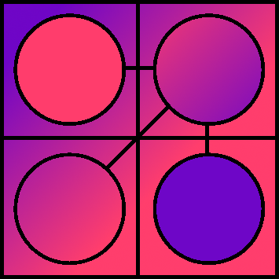
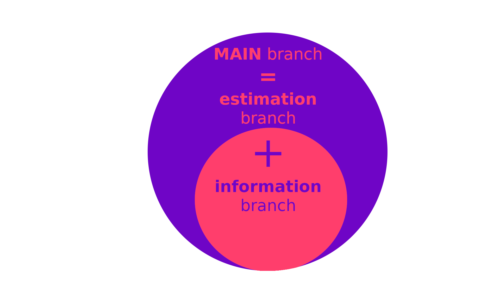

---
tags:
  - LANG/RU
  - STRUCT/SYSTEM
---
---

# Термины и определения:
1. **Граф компетенций** (**ГК**)- структура содержащая узлы с различными [Описание хештегов#Структурные роли](./docs/system/.md);
2. **Матрица компетенций** (**МК**) в **широком** смысле это - это HR-инструмент, который помогает оценить ключевые способности сотрудника для конкретной должности или области (**[Иточник](https://b2b.productstar.ru/blog/obuchenie_pod_matrizu)**). Чаще всего представляется в виде таблицы, но не ограничивается ею;
3. **Матрица компетенций** (**МК**) в **узком** смысле это - структура генерируемая на основе **графа компетенций** для конкретной роли в конкретной команде;
4. [[Описание хештегов#Структурные роли узлов#Список|Системный, информационный, тематический узел]]; 
---
# Цели графа компетенций:
1. Визуализировать знания в приятном формате для чтения, добавления и перемещения;
2. Автоматизировать и унифицировать оценку знаний программистов;
	- Структура матрицы компетенции генерируется автоматически, исходя из наполнения [уровней компетенций](Описание%20хештегов.md#Уровень%20компетенций), выбранных [[Описание хештегов#Структурные роли узлов#Список|тематических узлов]] и их пороговых значений.
3. Масштабировать и адаптировать оценку под цели команд;
	- Каждая команда будет иметь возможность генерировать структуру матрицы компетенций и на её основе получать материал для тестирования.   
4. Создать открытое сообщество систематизирующее знания и их оценку.
	- Предоставить возможность каждому желающему поучаствовать в создании базы знаний и оценок;
	- Валидировать структуру новвоведений через прогон тестов в CI;
	- Валидировать смысловую составляющую через менторов и владельцев графа.
p.s. в цели графа компетенций не входит мониторинг знаний штатных сотрудников.
---
# Быстрый старт для команды
Всё начинается с того, что в команду понадобился новый сотрудник и команде следует оценить его знания. Для автоматизации проверки этих знаний следует использовать задание сгенерируемое по матрице компетенции из графа компетенций.
Чтобы получить матрицу компетенций, следует сгенерировать её по инструкции ниже или взять [[Шаблон матрицы компетенций|готовый шаблон]] и перейти к пункту 3 из инструкции ниже.
Шаги для генерации тестов:
 1. Открыть проект MatrixGenerator и следовать по инструкции #TODO добавить ссылку на инструкцию;
 2. На выходе получим файл "Competence matrix template.md";
 3. Открываем его и изменяем дефолтные значения под свои нужды;
 4. Открыть проект TestGenerator и следовать по инструкции #TODO добавить ссылку на инструкцию;
 5. На выходе мы получаем некий файл с тестовыми заданиями (скорее всего это будет MD файл);
 6. Вместе с тестируемым заполняем его;
 7. Открываем EstimationGenerator и следуем его инструкции #TODO добавить ссылку на инструкцию
 8. На выходе получаем некоторую статистику по прохождению (если будем хранить другие прохождения, то сравнительную статистику).
#TODO
---
# Быстрый старт тестируюмого
#TODO Если документ с заданиями будет заполняться командой, то этого пункта не будет.

---
# Быстрый старт для контрибьюторов
Проект содержит две ветки:
1. **MAIN** - содержит все структурные узлы;
2. **information** - содержит только информационные и тематические узлы;
Контрибьютор может помочь проекту несколькими способами:
 1. Добавить в информацию в любой раздел [[#Дорожная карта развития|дорожной карты развития]];
 2. Добавить в структуру тематические узлы из раздела [[#Перечень недостающих тем|перечень недостающих тем]];
 3. Добавить в структуру оценивающих узлов;
**Подсказки**:
Один PullRequset должен состоять из двух коммитов:
1. 1-й содержит тематические узлы и информационные узлы;
2. 2-1 содержит оценивающие узлы.
Это позволит использовать cherry pick для переноса коммита из **MAIN** ветки в **information** ветку, которая содержит только теорию и топики.

Устанавливаем Obsidian и плагины:
1. Dataview;
3. Editing toolbar;
4. Iconize;
5. Wikilinks to MDLinks;
Установить настройки:
1. Options -> Files and links -> Wikilinks -> on
---
# Дорожная карта развития
#TODO описать перечень недостающих тем или наличие оценивающих узлов (голосование оформить через Polly)
## Перечень недостающих тем
1. #TODO сортировать по приоритету (придумать механизм голосования).
Возможно, это будет собираться через лагин DataView https://www.youtube.com/watch?v=66iB9hNHYQI  .
## Степень покрытия тем по заданиями.
1. #TODO генерировать автоматически (возможно таблица)
## Перечень не решённых проблем:
 1. MD не поддерживает объединение клеток в таблице;
	 1. Вроде есть плагины, которые помогут эту проблему решить (DataView);
	 2. Пример объединения клеток https://forum.obsidian.md/t/merge-cells-in-dataview-for-grouped-content/54985
	 3. Не удобно править HTML таблицы в Obsidian;
	 4.  Возможно, будем стараться поддерживать MD Obsidian с плагинами;
## Идеи для реализации:
1. Предлагаю сделать визуализацию результатов тестирования графа компетенций, как на рисунке ниже.
	
2. Можно создать метрику актуальности информационного узла (темы/топик). Она будет собирать информацию о том какое кол-во раз топик использовался для генерации теста.
3. Создать рейтинговую таблицу по каждому топику.
4. Запускать в CI сборках [[Описание тестирования консистнтности|проверки на консистентность]]. Проверки на консистентность писать, используя PSI интерфейсы IDEA, чтобы иметь возможность перенести наработки из проверки в CI в проверки через плагин.   
---
# Вдохновлено:
1. Шаблон 1 матрицы - Александр Шелаухов; 
2. Шаблон 2 матрицы - Родин Денис;
3. Курс Java Middle Developer - Ленок Антон;
4. Курс Java Beginner - Кудряшёв Сергей;
5. "Куда  расти?" с Андреем Смирновым;
---

# ЧАВО (Частые вопросы)
- Как работать с Mark Down разметкой?
	- [[Шпаргалка по синтаксису разметки Markdown|Что такое Mark Down]];
	- Инструкция для Obsidian - [почитать](https://publish.obsidian.md/help-ru/Начните+здесь);
	- Инструкция для Obsidian - [посмотреть](https://rutube.ru/video/bec4ef4f5aea83cc161ad98569e414af/)
- Почему выбран Mark Down ?
	1. MD - хорошо человекочитаемый формат, который поддерживает множество приложений и парсеров.
	2. Проще, чем HTML.
	3. Его изменения легко просматриваются в GIT и многие сайты-репозитории поддерживают его отображение.
- Почему этот репозиторий не в CodeHub?
	1. Вся информация содержащаяся здесь не имеет конфиденциального характера.
	2. Открытость репозитория призвана привлекать внимание к работе в компании  и её продуктам (GitVerse). 
+ Тестируемые подготовят ответы по всей базе знаний вопросы и не будут учить материал !?
	+ Вопросы будут лежать в отдельной ветке "estimation" и она будет закрыта для обычных пользователей.
+ Как формируется пороговое значение для уровней компетенций?
	+ Пороговое значение до этапа формирования **МК** для [[Шаблон тематического узла| тематического узла]]может быть задано в ручном режиме в разделе [[Шаблон тематического узла#Пороговые значения|пороговые значения]]. 
	+ Если раздел не заполнен, то 100% делится на равные части таким количеством точек, сколько содердит [[Описание хештегов#Уровень компетенций#Список|список уровней компетенций]].
	+ После формирования **МК**, команда может изменить эти уровни в шаблоне на своё усмотрение.
+ Как происходит рачёт % знания по теме?
	+ Он рассчитывается по формуле:
	$$
	(100 * R)/S 
	$$
	 , где
	 R - кол-во набранных баллов по теме и подтемам;
	 S - максимально возможное кол-во баллов по теме и подтемам;
	 Оценивающие узлы имеют разную [[Описание хештегов#Сложность Описание хештегов Структурные роли узлов оценивающих узлов|сложность]]. 
	 Их ценность распределяется следующим образом:
	 #COMPLEXITY/ADVANCED= 2 * #COMPLEXITY/MEDIUM ;
	 #COMPLEXITY/MEDIUM= 2 * #COMPLEXITY/BASIC ;
	 #COMPLEXITY/BASIC =  максимум 5 баллов;
+ Почему некоторые [[Шаблон тематического узла#Пороговые значения*|заголовки]] в шаблонах написаны со звёздочкой в конце?
	+ Звёздочка означает необязательность наличие такого заголовка в узле.
---
